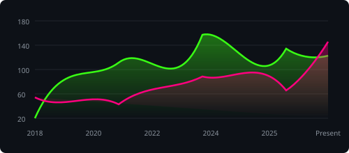
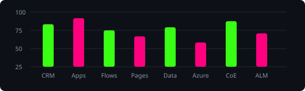
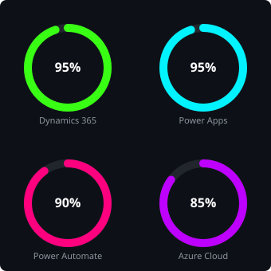

<h2 align="center"> Hey Everyone , I'm Rina Shad</h2>

  <!-- Typing SVG for dynamic text effect -->
  

<!-- Right-aligned developer illustration from the reference image -->

  🧑‍💻 <b>Senior Dynamics 365 CRM & Power Platform Architect</b> with 8+ years of experience designing, developing, and delivering enterprise-scale business solutions across healthcare, fintech, eCommerce, government, and professional services environments. Extensive experience leading full project lifecycles including discovery, requirements gathering, solution architecture, development, testing, deployment, training, hypercare, and production support.

 

  <ul>
    <li>🛠️ Expert in <b>Dynamics 365 CRM</b> (Sales, Service, Marketing, Field Service, Project Operations) and <b>Microsoft Power Platform</b> (Canvas/Model-Driven Apps, Power Automate, Power Pages, Dataverse, Power BI).</li>
    <li>🔒 Strong focus on Architecture, Governance (<b>Power Platform Center of Excellence - CoE</b>), DLP Policies, ALM, and Security Compliance (HIPAA, PCI-DSS, GDPR).</li>
    <li>⚙️ Skilled in enterprise integrations using <b>Azure Functions, Logic Apps, Service Bus, API Management</b>, and <b>Microsoft Graph API</b>.</li>
    <li>🤝 Open to collaboration on CRM architecture, enterprise integrations, and mentoring development teams.</li>
  </ul>

  <!-- Visitor Counter - Replace YOUR_GITHUB_USERNAME with your actual username -->
  

  <!-- Social Badges - Replace placeholders with your links -->
  
  

 

### 📊 Technical Skill & Performance Analytics

<!-- Custom Neon SVG Dashboard Section -->
<table align="center" width="100%">
  <tr>
    <td valign="top" width="55%">
      <!-- Left side: Area Line Chart -->
      <h4 align="center">📈 Architecture & Integration Growth Trend</h4>
      
        
      <!-- Left side bottom: Bar Chart -->
      <h4 align="center">📊 Technology Implementation Load</h4>
      
    </td>
    <td valign="top" width="45%">
      <!-- Right side: Circular Progress Rings -->
      <h4 align="center">🎯 Platform Expertise Matrix</h4>
      
    </td>
  </tr>
</table>

### 📈 Skill Proficiency Meter

  <ul>
    <li><b>Dynamics 365 CRM & Customization</b> &nbsp;&nbsp;&nbsp; <code>████████████████████</code> <b>95%</b></li>
    <li><b>Power Apps (Canvas & Model-Driven)</b> &nbsp;&nbsp; <code>████████████████████</code> <b>95%</b></li>
    <li><b>Power Automate & Logic Apps</b> &nbsp;&nbsp;&nbsp;&nbsp;&nbsp;&nbsp;&nbsp;&nbsp;&nbsp;&nbsp;&nbsp; <code>██████████████████░░</code> <b>90%</b></li>
    <li><b>C# & CRM Plugin Development</b> &nbsp;&nbsp;&nbsp;&nbsp;&nbsp;&nbsp;&nbsp;&nbsp;&nbsp;&nbsp; <code>████████████████░░░░</code> <b>80%</b></li>
    <li><b>JavaScript & PCF Control Dev</b> &nbsp;&nbsp;&nbsp;&nbsp;&nbsp;&nbsp;&nbsp;&nbsp;&nbsp; <code>████████████████░░░░</code> <b>80%</b></li>
    <li><b>Azure Cloud Integrations</b> &nbsp;&nbsp;&nbsp;&nbsp;&nbsp;&nbsp;&nbsp;&nbsp;&nbsp;&nbsp;&nbsp;&nbsp;&nbsp;&nbsp;&nbsp;&nbsp;&nbsp;&nbsp; <code>████████████████░░░░</code> <b>80%</b></li>
    <li><b>Power Platform CoE & Governance</b> &nbsp;&nbsp;&nbsp;&nbsp;&nbsp;&nbsp; <code>█████████████████░░░</code> <b>85%</b></li>
    <li><b>ALM, CI/CD & DevOps</b> &nbsp;&nbsp;&nbsp;&nbsp;&nbsp;&nbsp;&nbsp;&nbsp;&nbsp;&nbsp;&nbsp;&nbsp;&nbsp;&nbsp;&nbsp;&nbsp;&nbsp;&nbsp;&nbsp;&nbsp;&nbsp;&nbsp;&nbsp;&nbsp; <code>████████████████░░░░</code> <b>80%</b></li>
  </ul>

### 🛠️ Technical Stack & Tools

  <!-- Dynamics & Power Platform -->
  
  
  
  
  
  

  <!-- Programming Languages -->
  
  
  
  
  
  

  <!-- Azure & Cloud Integrations -->
  
  
  
  
  

### 🏅 Professional Certifications

  
  

### 📊 Core Areas of Focus & Architectures

<table align="center" width="90%">
  <tr>
    <td valign="top" width="50%">
      

        <h4>⚙️ Dynamics 365 CRM</h4>
        <ul>
          <li>CRM Configuration & Customization</li>
          <li>Plugins & Custom Workflow Activities</li>
          <li>PCF Controls & Ribbon Customization</li>
          <li>Business Process Flows & Client Scripting</li>
        </ul>
      

    </td>
    <td valign="top" width="50%">
      

        <h4>🔌 Cloud Integrations</h4>
        <ul>
          <li>REST APIs & custom connectors</li>
          <li>Microsoft Graph API & SharePoint</li>
          <li>Azure Logic Apps & Service Bus</li>
          <li>Azure Functions & Webjobs</li>
        </ul>
      

    </td>
  </tr>
  <tr>
    <td valign="top" width="50%">
      

        <h4>🛡️ Governance & Security</h4>
        <ul>
          <li>Power Platform Center of Excellence (CoE)</li>
          <li>Application Lifecycle Management (ALM)</li>
          <li>Environment Strategy & DLP Policies</li>
          <li>HIPAA, PCI-DSS, GDPR Compliance</li>
        </ul>
      

    </td>
    <td valign="top" width="50%">
      

        <h4>📋 Project Management</h4>
        <ul>
          <li>Agile / Scrum methodologies</li>
          <li>Azure DevOps & CI/CD Pipelines</li>
          <li>Requirements Discovery & workshops</li>
          <li>Technical Leadership & mentoring</li>
        </ul>
      

    </td>
  </tr>
</table>
